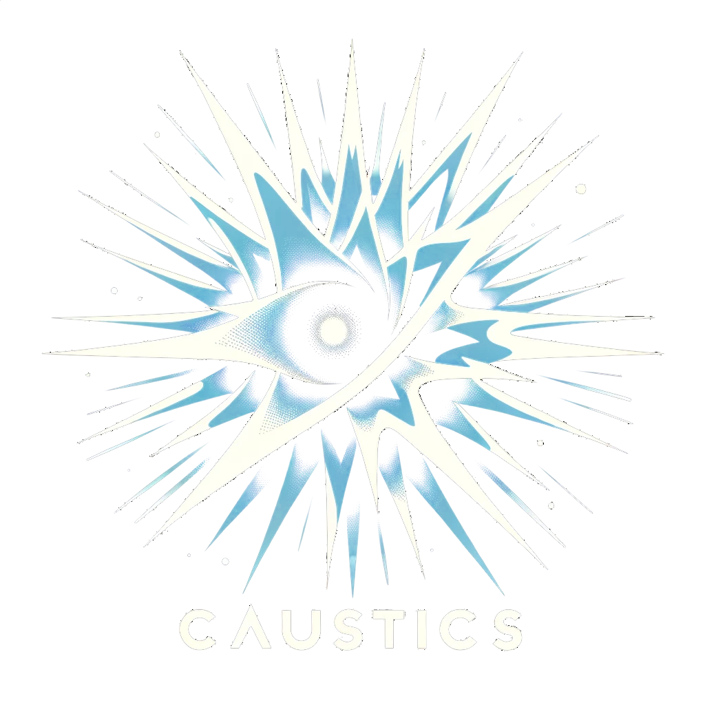
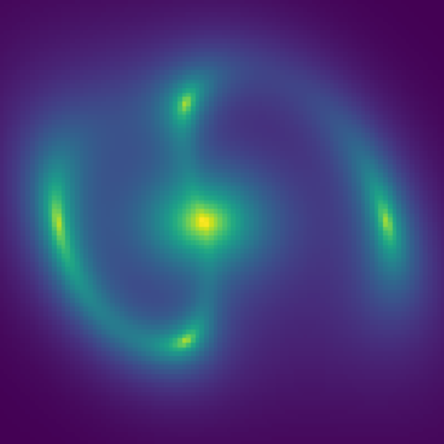
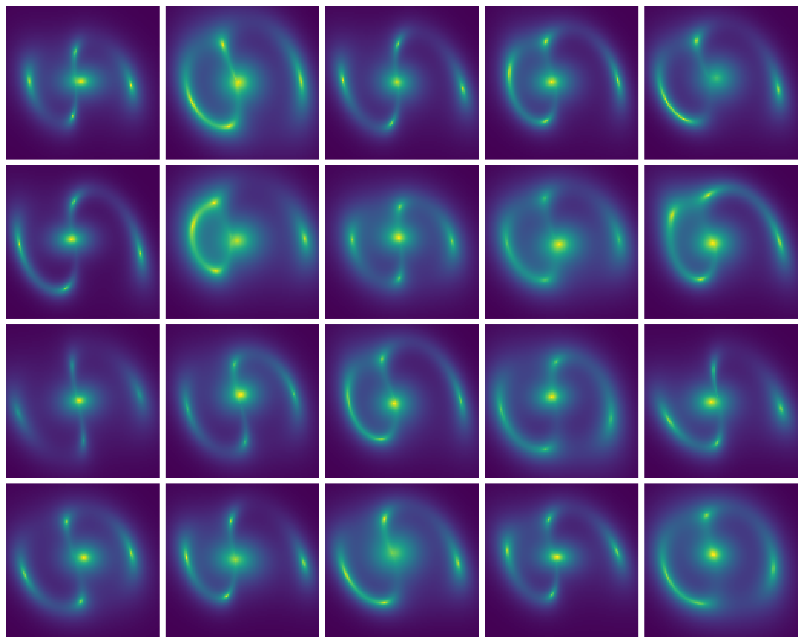
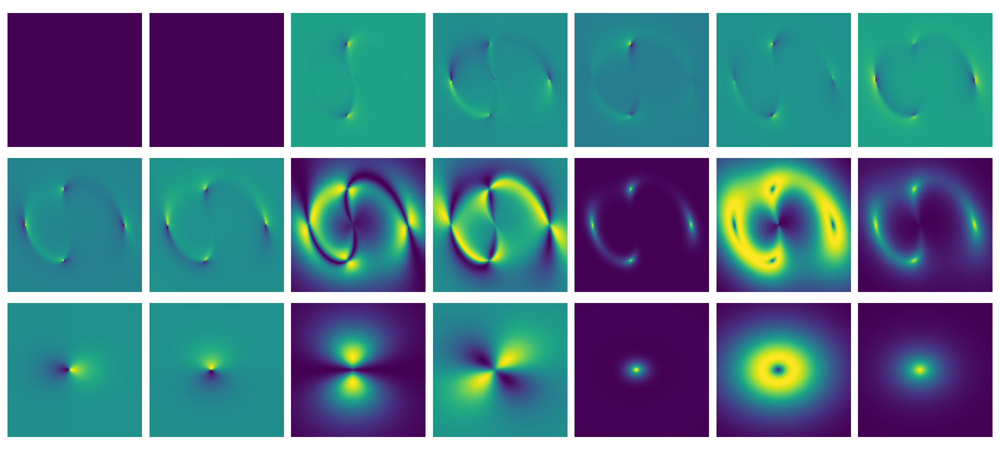

<picture>
  <source media="(prefers-color-scheme: dark)" srcset="https://github.com/Ciela-Institute/caustics/blob/main/media/caustics_logo.png?raw=true">
  <source media="(prefers-color-scheme: light)" srcset="https://github.com/Ciela-Institute/caustics/blob/main/media/caustics_logo_white.png?raw=true">
  
</picture>

[](https://escience.washington.edu/software-engineering/ssec/)
[](https://github.com/Ciela-Institute/caustics/actions/workflows/ci.yml)
[](https://results.pre-commit.ci/latest/github/Ciela-Institute/caustics/main)
[](https://caustics.readthedocs.io/en/latest/?badge=latest)
[](https://pypi.org/project/caustics/)
[](https://app.codecov.io/gh/Ciela-Institute/caustics)
[](https://joss.theoj.org/papers/995fa98462eb534a32952549ef2244f8)
[](https://zenodo.org/doi/10.5281/zenodo.10806382)
[](https://arxiv.org/abs/2406.15542)

# caustics

The lensing pipeline of the future: GPU-accelerated,
automatically-differentiable, highly modular. Currently under heavy development:
expect interface changes and some imprecise/untested calculations.

## Installation

Simply install caustics from PyPI:

```bash
pip install caustics
```

## Minimal Example

```python
import matplotlib.pyplot as plt
import caustics
import torch

cosmology = caustics.FlatLambdaCDM()
sie = caustics.SIE(cosmology=cosmology, name="lens")
src = caustics.Sersic(name="source")
lnslt = caustics.Sersic(name="lenslight")

x = torch.tensor([
#   z_s  z_l   x0   y0   q    phi     b    x0   y0   q     phi    n    Re
    1.5, 0.5, -0.2, 0.0, 0.4, 1.5708, 1.7, 0.0, 0.0, 0.5, -0.985, 1.3, 1.0,
#   Ie    x0   y0   q    phi  n   Re   Ie
    5.0, -0.2, 0.0, 0.8, 0.0, 1., 1.0, 10.0
])  # fmt: skip

minisim = caustics.LensSource(
    lens=sie, source=src, lens_light=lnslt, pixelscale=0.05, pixels_x=100
)
plt.imshow(minisim(x, quad_level=3), origin="lower")
plt.axis("off")
plt.show()
```



### Batched simulator

```python
newx = x.repeat(20, 1)
newx += torch.normal(mean=0, std=0.1 * torch.ones_like(newx))

images = torch.vmap(minisim)(newx)

fig, axarr = plt.subplots(4, 5, figsize=(20, 16))
for ax, im in zip(axarr.flatten(), images):
    ax.imshow(im, origin="lower")
plt.show()
```



### Automatic Differentiation

```python
J = torch.func.jacfwd(minisim)(x)

# Plot the new images
fig, axarr = plt.subplots(3, 7, figsize=(20, 9))
for i, ax in enumerate(axarr.flatten()):
    ax.imshow(J[..., i], origin="lower")
plt.show()
```



## Documentation

Please see our [documentation page](https://caustics.readthedocs.io/en/latest/)
for more detailed information.

## Contribution

We welcome contributions from collaborators and researchers interested in our
work. If you have improvements, suggestions, or new findings to share, please
submit an issue or pull request. Your contributions help advance our research
and analysis efforts.

To get started with your development (or fork), click the "Open with GitHub
Codespaces" button below to launch a fully configured development environment
with all the necessary tools and extensions.

[](https://codespaces.new/uw-ssec/caustics?quickstart=1)

Instruction on how to contribute to this project can be found in the
CONTRIBUTION.md

Some guidelines:

- Please use `isort` and `black` to format your code.
- Use `CamelCase` for class names and `snake_case` for variable and method
  names.
- Open up issues for bugs/missing features.
- Use pull requests for additions to the code.
- Write tests that can be run by [`pytest`](https://docs.pytest.org/).

Thanks to our contributors so far!

[](https://github.com/Ciela-Institute/caustics/graphs/contributors)
