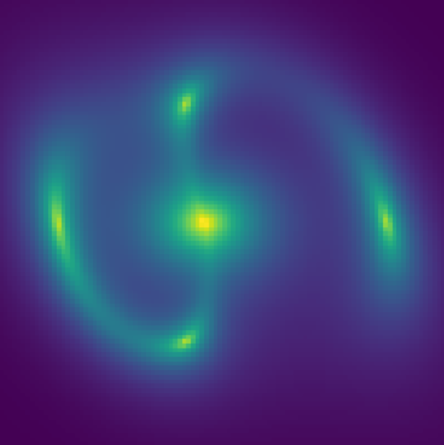
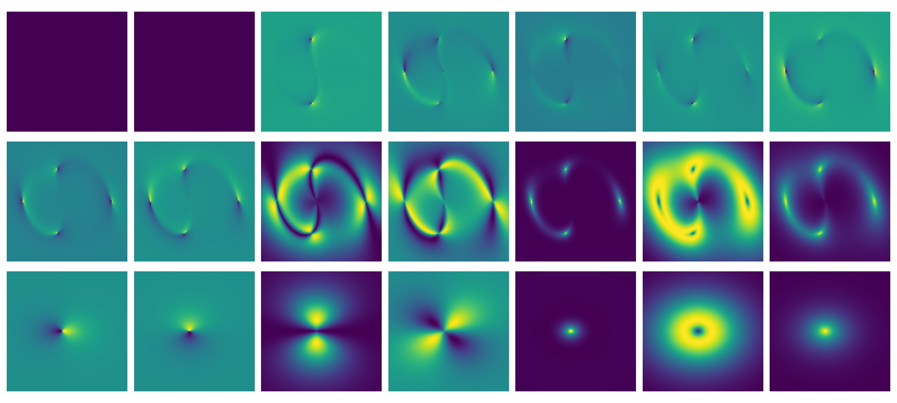

# Welcome to Caustics’ documentation!

[](https://github.com/Ciela-Institute/caustics)

The lensing pipeline of the future: GPU-accelerated,
automatically-differentiable, highly modular and extensible. All code is
installable with `pip` and hosted on
[GitHub](https://github.com/Ciela-Institute/caustics).

## Installation

The easiest way to install is to make a new virtual environment then run:

```console
pip install caustics
```

this will install all the required libraries and then install `caustics` and you
are ready to go! You can check out the tutorials afterwards to see some of
`caustics`' capabilities. If you want to help out with building the `caustics`
code base check out the developer installation instructions instead.

## Minimal Example

```python
# fmt: off
import matplotlib.pyplot as plt
import caustics
import torch

cosmology = caustics.FlatLambdaCDM()
sie = caustics.SIE(cosmology=cosmology, name="lens", z_l=0.5, z_s=1.0, x0=-0.2, y0=0.0, q=0.4, phi=1.5708, Rein=1.7)
src = caustics.Sersic(name="source", x0=0.0, y0=0.0, q=0.5, phi=-0.985, n=1.3, Re=1.0, Ie=5.0)
lnslt = caustics.Sersic(name="lenslight", x0=-0.2, y0=0.0, q=0.8, phi=0.0, n=1.0, Re=1.0, Ie=10.0)

sim = caustics.LensSource(lens=sie, source=src, lens_light=lnslt, pixelscale=0.05, pixels_x=100)

plt.imshow(sim(), origin="lower")
plt.axis("off")
plt.show()
```



### Batched simulator

```python
sim.to_dynamic(False)
cosmology.to_static()
x = sim.build_params_tensor()
newx = x.repeat(20, 1)
newx += torch.normal(mean=0, std=0.1 * torch.ones_like(newx))

images = torch.vmap(sim)(newx)

fig, axarr = plt.subplots(4, 5, figsize=(20, 16))
for ax, im in zip(axarr.flatten(), images):
    ax.imshow(im, origin="lower")
plt.show()
```


### Automatic Differentiation

```python
J = torch.func.jacfwd(sim)(x)

# Plot the new images
fig, axarr = plt.subplots(3, 7, figsize=(20, 9))
for i, ax in enumerate(axarr.flatten()[2:]):
    ax.imshow(J[..., i], origin="lower")
plt.show()
```



## Contents

```{tableofcontents}

```
