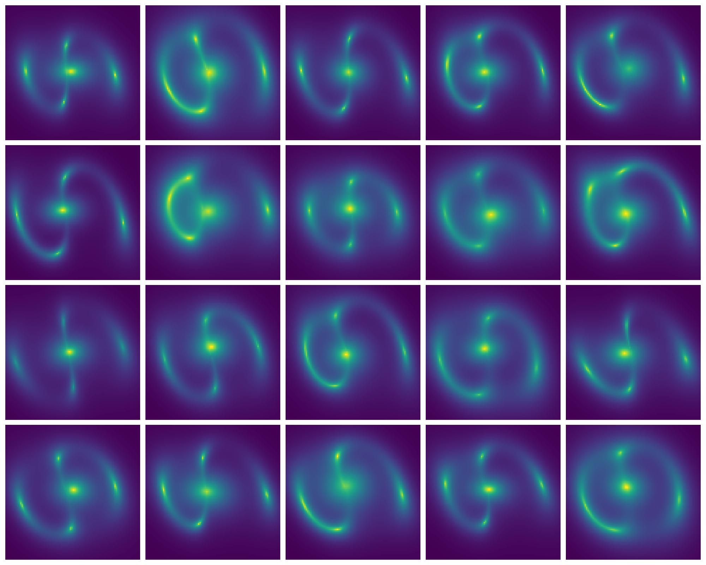

# Welcome to Caustics’ documentation!

The lensing pipeline of the future: GPU-accelerated,
automatically-differentiable, highly modular and extensible.

```{note}
Caustics is in its early development phase. This means the API will change with time. These changes are a good thing, but they can be annoying. Watch the version numbers, when we get to 1.0.0 that will be the first stable release!
```

## Installation

The easiest way to install is to make a new virtual environment then run:

```console
pip install caustics
```

this will install all the required libraries and then install caustics and you
are ready to go! You can check out the tutorials afterwards to see some of
caustics' capabilities. If you want to help out with building the caustics code
base check out the developer installation instructions instead.

## Minimal Example

```python
import matplotlib.pyplot as plt
import caustics
import torch

cosmology = caustics.FlatLambdaCDM()
sie = caustics.SIE(cosmology=cosmology, name="lens")
src = caustics.Sersic(name="source")
lnslt = caustics.Sersic(name="lenslight")

x = torch.tensor([
#   z_s  z_l   x0   y0   q    phi     b    x0   y0   q     phi    n    Re
    1.5, 0.5, -0.2, 0.0, 0.4, 1.5708, 1.7, 0.0, 0.0, 0.5, -0.985, 1.3, 1.0,
#   Ie    x0   y0   q    phi  n   Re   Ie
    5.0, -0.2, 0.0, 0.8, 0.0, 1., 1.0, 10.0
])  # fmt: skip

minisim = caustics.LensSource(
    lens=sie, source=src, lens_light=lnslt, pixelscale=0.05, pixels_x=100
)
plt.imshow(minisim(x, quad_level=3), origin="lower")
plt.show()
```


### Batched simulator

```python
newx = x.repeat(20, 1)
newx += torch.normal(mean=0, std=0.1 * torch.ones_like(newx))

images = torch.vmap(minisim)(newx)

fig, axarr = plt.subplots(4, 5, figsize=(20, 16))
for ax, im in zip(axarr.flatten(), images):
    ax.imshow(im, origin="lower")
plt.show()
```



### Automatic Differentiation

```python
J = torch.func.jacfwd(minisim)(x)

# Plot the new images
fig, axarr = plt.subplots(3, 7, figsize=(20, 9))
for i, ax in enumerate(axarr.flatten()):
    ax.imshow(J[..., i], origin="lower")
plt.show()
```


## Contents

```{tableofcontents}

```
