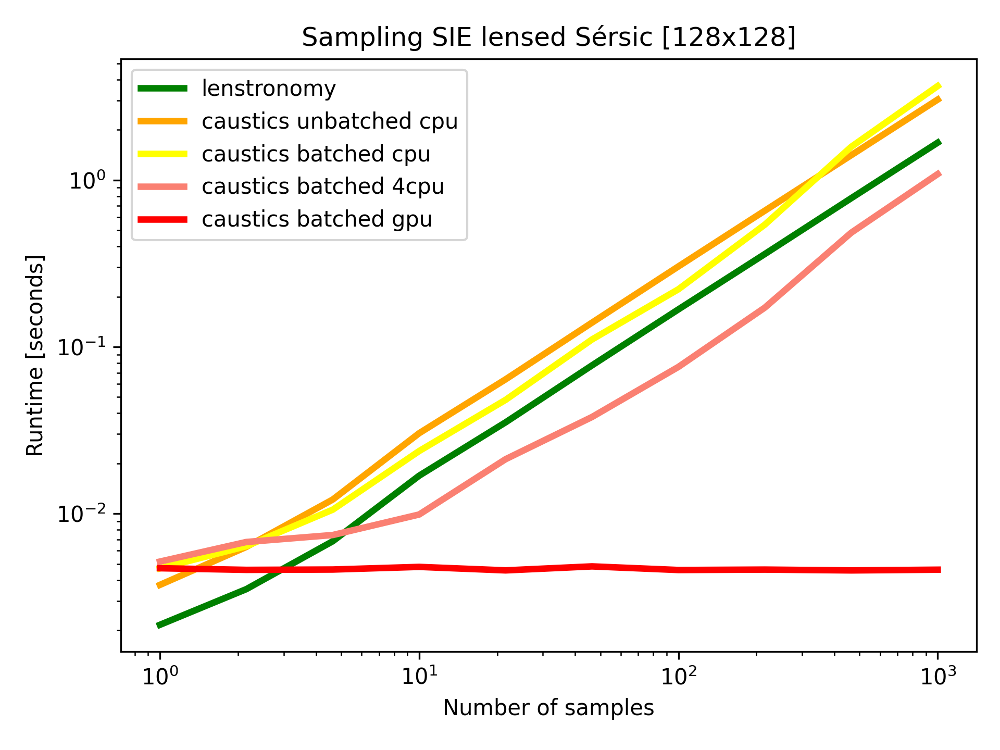
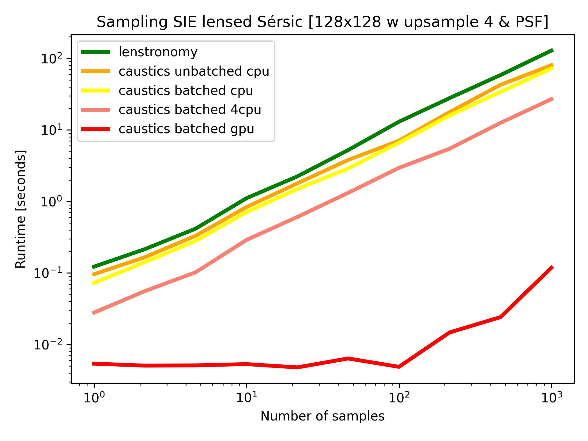

# Summary

Gravitational lensing occurs when light passes by a massive body, the path of
the light is then deflected from its original trajectory. In astronomy this
phenomenon is observed in a variety of configurations, often involving galaxies
and clusters of galaxies, which must align within a fraction of a degree on the
sky. As more lens systems have been discovered (hundreds), they have emerged as
a key tool for making precision measurements and answering pressing questions in
astrophysics. Notable among these is the measurement of the expansion rate of
the Universe [@holycow], for which lensing has quickly become competitive in the
state-of-the-art. Lensing also promises to unlock information about dark
matter[@Hezaveh2016], supernovae [@Rodney2021], and the first stars [@Welch2022]
among other topics. Here we present a code `caustics` to massively accelerate
the detailed modelling of such lensing systems.

# Statement of need

Unlocking the exciting potential of graviational lensing will require processing
hundreds of thousands of lenses [@rubinlenses] expected to be discovered in the
next generation of surveys (Rubin, Euclid, Roman, and more). The current state
of lensing analysis, however, requires many days to solve even a single system
[@], so computational advancements like GPU acceleration and algorithmic
advances like automatic differentiation are needed to make the computational
timescales realistic for such large samples. `caustics` is built with the future
of lensing in mind, using `PyTorch` [@pytorch] to accelerate the low level
computation and enable new kinds of algorithms which rely on automatic
differentiation (e.g. HMC [@hmc]). With these tools available, `caustics` will
provide greater than two orders of magnitude acceleration to most standard
operations, unlocking previously infeasible analyses at scale.

`caustics` is not the only gravitational lensing code publicly available, the
well established `lenstronomy` package has been in use since 2018
[@lenstronomy], `PyAutoLens` is also widely used [@PyAutoLens], GIGA-Lens is a
specialized JAX [@JAX] based gravitational lensing package [@GIGALens].
`Lenstronomy` is fully featured and has been widely used in the gravitational
lensing community. The goal of `caustics` development has been primarily focused
on three aspects, processing speed, user experience, and flexibility. The
processing speed is primarily derived from PyTorch and `caustics` has been
optimized to take full advantage of its features. The user experience is
streamlined by providing three interfaces to the code: configuration file,
object-oriented, and functional where each interface level requires more
expertise but unlocks more capability. In this way, even users with no previous
lensing experience can smoothly transition to power users of `caustics`.
Flexibility is achieved by a determined focus on minimalism in the core
functionality of `caustics`.

# Performance

Here we discuss the performance enhancements available in `caustics`. The code
allows operations to be batched and multi-threaded or sent to GPU, which can
provide substantial performance enhancements. In Fig. 1 we demonstrate this by
sampling images of a S\'ersic with an SIE model lensing the image. In the two
subfigures we show performance for simply sampling a "direct" 128x128 image, and
sampling a "realistic" image which is upsampled by a factor of 4 and convolved
with a PSF. This demonstrates a number of interesting facts about numerical
performance in such scenarios.

First, we observe the relative performance of Lenstronomy and `caustics`, where
the most direct comparison is with the "caustics unbatched cpu" line.
Lenstronomy is written using the `numba` [@numba] package which compiles python
code, we can see in the direct sampling the python overhead incurred by
`caustics` is significant and Lenstronomy is nearly twice as fast. In the
realistic scenario the extra computations (4x for each pixel and convolution)
dominate the runtime and the python overhead is no longer relevant, in fact it
seems that the PyTorch sampling implementation is almost twice as fast. Here we
see that performance can vary considerably depending on the setup and conclude
that one can expect comparable performance between `caustics` and `lenstronomy`
with naive implementations on CPU.

Comparing the "caustics unbatched cpu" and "caustics batched cpu" lines we see
that in some scenarios (the direct sampling) batching can provide more efficient
use of a CPU and improve performance. However, in the realistic scenario the
batching actually reduces performance, it is not entirely clear why this is the
case given that batching should behave merely as a compiled for-loop instead of
a Python for-loop which is slow. We hypothesize that this is due to the extra
memory allocation requirements to collect all operations into a single large
tensor.

Comparing "caustics batched cpu" and "caustics batched 4cpu" we see that
PyTorch's automatic multi-threading capabilities can indeed provide performance
enhancements. However, the enhancement is not a direct multiple of the number of
CPUs due to overhead. Thus, if one has many CPUs when running, say, multiple
MCMC chains, it is better to "dumb parallelize" the problem ahead of time.

Finally, comparing any of the lines with "caustics batched gpu" we see the real
power of batched operations. Communication betweeen a CPU and GPU is slow, so
condensing many calculations into a single command means that `caustics` is
capable of fully exploiting a GPU. In the direct sampling the GPU never
"saturates" meaning that it runs equally fast for any number of samples. In the
realistic scneario we hit the limit of the GPU memory and so had to break up the
operations beyond 100 samples, which is when the GPU performance begins to slow
down. Either way, it is possible to easily achieve over 100X speedup over CPU
performance, making GPUs by far the most efficient method to perform large
lensing computations such as running many MCMC chains, sampling many lensing
realizations (training ML), or sampling large numbers of subhalos.

# User experience

Here we briefly discuss the user experience, via our three levels of interface.
The simplest interface is through configuration files. A configuration file is a
`.yaml` file which specifies the qualities of a gravitational lensing simulator.
Thus one may specify that a S\'ersic will be lensed with an SIE model and an
external shear to produce an image of a given size, including PSF convolution
and gaussian quadrature sub-pixel integration. The user may then load such a
simulator in a single line of Python and carry on using that simulator as a pure
function `f(x)` which takes in parameters such as the sersic index, position,
SIE einstein radius, etc. and returns an image. This interface is
straightforward for new users and for simplifying the passing of codes between
users.

The second level of interface is the object oriented interface, which allows
users to interact with light sources and lenses as objects. The user may build
simulators just like the configuration file interface, or they may interact with
the objects in a number of other ways accessing further details about each lens.
Users may apply the full flexability of Python with these lensing objects and
may construct analysis code however they like, though there are many default
routines which enable one to quickly perform typical analysis tasks.

Finally, there is the functional interface. The functional interface eschews the
object oriented `caustics` code, instead giving the user access to individual
mathematical operations related to lensing, most of which are drawn directly
from gravitational lensing literature. All such functions include references in
their documentation to the relevant papers and equation numbers from which they
are derrived. These equations have been tested and implemented in a reasonably
efficient manner. Thus the functional interface in `caustics` gives power users
the ability to experiment with new lensing concepts while taking advantage of
already tested code for a broad range of lensing concepts.

Each layer is in fact built on the one below it, making the transition from one
to the other a matter of following documentation and code references. This makes
the transition easy since one may very clearly observe how their current
analysis can be reproduced in the lower level. From there one may experiment
with the new flexibility. `Caustics` thus provides a straightforward pipeline
for users to move from beginner to power user.

# Flexibility

The way in which `caustics` achieves flexability is perhaps already clear from
the user experience section, though we elaborate here for completeness. A core
feature in the development of `caustics` has been flexibility, we did not want
users to be driven to a single form of analysis. Development has focused solely
on gravitational lensing in a simulator framework where the ultimate product is
a function `f(x)` which can then naturally be passed to other optimization
and/or sampling packages which have already been rigorously developed and
tested, such as `scipy.optimize` [@scipy], `emcee` [@emcee], and `Pyro` [@pyro].
The user is not locked into any single analysis paradigm.

Further, it is possible to probe the lensing objects in a number of useful ways.
Each lensing object has (where meaningful) a well defined convergence,
potential, and deflection field and we provide examples to visualize all of
these. Since `caustics` is differentiable, it is trivial to extract critical
curves and we provide examples of these visualizations. Our Jupyter notebook
tutorials also include examples of many typical analysis routines, though with
the detailed "layed out" for the user so they may simply copy and modify to suit
their particular analysis task. Thus, we achieve flexability both by allowing
many analysis paradigms, and by facilitating the easy development of such
paradigms.

# Conclusions

Here we have presented `caustics` a gravitational lensing simulator framework
which allows for greater than 100X speedup over CPU implementations by
efficiently using GPU resources. `Caustics` is "fully featured", meaning one can
straightforwardly model any strong lensing system with state of the art
techniques. The code and documentation facilitate users transition from beginner
to expert by providing three interfaces which allow increasingly more
flexability in how one wishes to model a lensing system. `Caustics` is designed
to be the gravitational lensing simulator of the future and to meet the massive
number of lenses soon to be discovered with equally powerful computational
resources.

# Acknowledgements

CS acknowledges the support of a NSERC Postdoctoral Fellowship and a CITA
National Fellowship. This research was enabled in part by support provided by
Calcul Qu\'ebec, the Digital Research Alliance of Canada, and a generous
donation by Eric and Wendy Schmidt with the recommendation of the Schmidt
Futures Foundation. Y.H. and L.P. acknowledge support from the National Sciences
and Engineering Council of Canada grants RGPIN-2020-05073 and 05102, the Fonds
de recherche du Québec grants 2022-NC-301305 and 300397, and the Canada Research
Chairs Program.

# References
